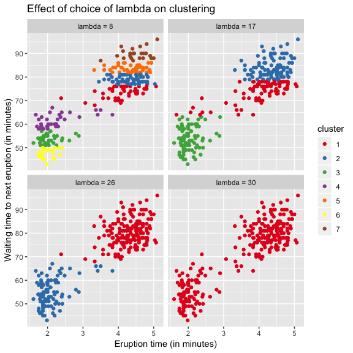

# DP-means clustering in R

This package implements the DP-means algorithm introduced by Kulis and Jordan in their article *[Revisiting k-means: New Algorithms via Bayesian Nonparametrics](https://arxiv.org/abs/1111.0352)*. Instead of specifying how many clusters to partition the data into, like one would with k-means, user controls cluster *creation* with penalty parameter λ which controls the creation of clusters during iteration:



The algorithm starts with a single cluster and then processes the data points, creating new clusters when needed, and then updates centers until convergence.

## Installation

```R
# install.packages("devtools")
devtools::install_github("bearloga/dpmclust")
```

## Usage

`dp_means()` returns an object with same class and components as `kmeans()` does, which makes it easy to use other packages that support the `kmeans` object (e.g. [`autoplot()` in the `ggfortify` package](https://cran.r-project.org/web/packages/ggfortify/vignettes/plot_pca.html)).

```R
y <- dp_means(x, lambda = 1)
# y$cluster
```

## Future Work

Currently there's only a pure R implementation which is a bit a slow so I still need to write a version in C++. Also need to implement [lambda means](https://ieeexplore.ieee.org/document/7899984) algorithm for choosing optimal λ.
